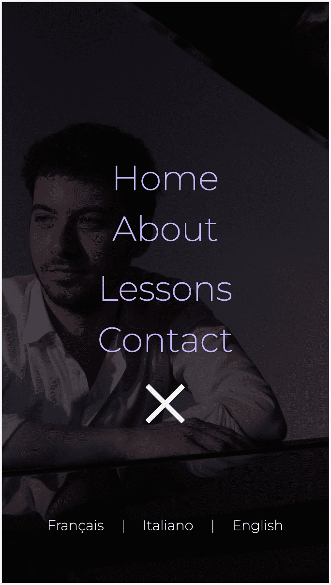
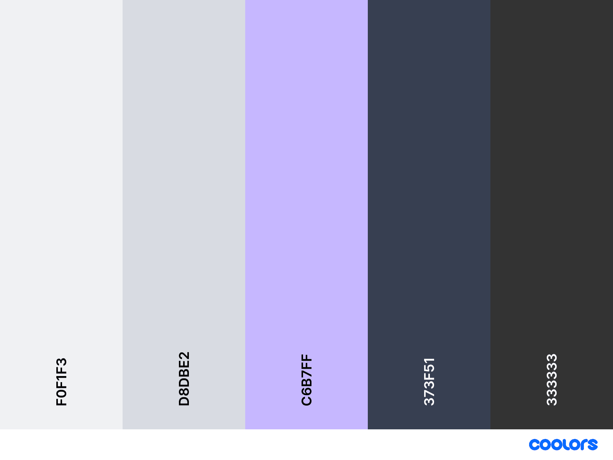

# Pianist Portfolio Website


Welcome to the README file for the Pianist Portfolio website. This single-page website showcases the information of a pianist in an elegant and functional design. The website is divided into four main sections: Header, About, Lessons, and Contact Form.

[Live link](https://aria-vero-s.github.io/pianist/).

## Table of Contents

- [Features](#features)
- [Technologies Used](#technologies-used)
- [Installation](#installation)
- [Usage](#usage)
- [Customization](#customization)
- [License](#license)
- [Contact](#contact)

---

## Features

### 1. Header
- A dynamic navbar that adjusts its appearance based on the user's scroll position.

- **Transparent Background at the Top:** When the user is at the top of the page, the navbar has a completely transparent background. This adds a touch of elegance to the design.


- **Semi-Transparent Dark Background on Scroll:** As the user scrolls down the page, the navbar transitions to a semi-transparent dark background. This subtle design change helps improve the navbar's visibility and ensures that navigation options remain accessible, especially against light content backgrounds.


- The nabar is also responsive and adjusts to different screen sizes:




- A full-page photograph of the pianist as the background.
- Three buttons for translating the website into English, French, and Italian using JavaScript.

```
  const translateFrenchButton = document.getElementById('translateFrench');
  translateFrenchButton.addEventListener('click', function() {
    updateContent('french', 'about');
    updateContent('french', 'lessons');
    updateContent('french', 'navbar');
    updateContent('french', 'contact');
  });
```

- Translations are managed through JavaScript objects.

```
const translations = {
 english: {
  about: {
   h1: "Hello, I'm Paolo",
   p1: "(paragraph 1)",
   p2: "(paragraph 2)"
  },
 },
},
```

### 2. About
- A biography section with information about the pianist.
- The client requested a video to be displayed on the right side of the About section later on. The video is an embedded YouTube video linked to the client's YouTube channel.
- A music player for showcasing the pianist's music, with playback controls.
- Music player functionality implemented using JavaScript.

```
    playPauseButton.addEventListener('click', () => {
        if (isPlaying) {
            audioPlayer.pause();
            playPauseButton.textContent = '▶';
        } else {
            audioPlayer.play();
            playPauseButton.textContent = '❚❚';
        }
        isPlaying = !isPlaying;
    });
```

### 3. Lessons
- A section providing text and a list of lesson details.
- Easily customizable to add or modify lesson information.
- The testimonial section includes a JavaScript carousel that allows users to view one testimonial at a time. The control buttons facilitate navigation between testimonials, enabling users to effortlessly move forward or backward in the carousel.

### 4. Contact Form
- A functional contact form using [Email.js](https://www.emailjs.com/) for sending messages to the pianist's email.
- Users can fill out the form to contact the pianist.

```
.sendForm("service_id", "template_id", contactForm)
      .then(
        function(response) {
          console.log("Email sent successfully", response);
          successMessage.style.display = "block";
        },
        function(error) {
          console.log("Email sending failed", error);
          console.error(error);

          // Additional debugging information:
          if (error.response) {
            console.log("Response data:", error.response.data);
            console.log("HTTP status:", error.response.status);
            console.log("Headers:", error.response.headers);
          }
          errorMessage.style.display = "block";
        }
      );
```

### Footer
- A footer section containing links to the pianist's social profiles. The social link icons are sourced from [FontAwesome](https://fontawesome.com/), a popular and widely-used icon library.

- A link to the developer's GitHub account in the copyright section.

### Design
- Dark theme with light purple highlights for an elegant and visually appealing look. The ```background-color: rgba(3, 3, 3, 0.7);``` found throughout the page mimics the reflection of the piano.


```
- antiflash-white: #f0f1f3;
- platinum: #d8dbe2;
- periwinkle: #c6b7ff;
- charcoal: #373f51;
- jet: #333333;
```

- The fonts have been applied strategically to create a cohesive and elegant design.

- **'Lato' for General Text**: The 'Lato' font, a versatile and legible sans-serif typeface, is used for general text throughout the website.

- **'Playfair Display' for Headings**: 'Playfair Display', a sophisticated serif font, is used for headings and titles.

- **'VVDS london oatmeal' for Logo**: The 'VVDS london oatmeal' font is reserved exclusively for the website's logo.
Please note that 'London Oatmeal' is a Demo Font provided for **PERSONAL USE** only. To acquire the full version and a commercial license for this font, please visit the following link: [Purchase 'London Oatmeal' Font](https://creativemarket.com/VintageVoyage/5079755-London-Oatmeal-%E2%80%A2-Stylish-Duo).
```
- font-family: 'Lato', sans-serif;
- font-family: 'Playfair Display', serif;
- font-family: 'VVDS london oatmeal';
```

### Image Credits

The images used in this project, the full-page photographs of the pianist and of the piano, were generously provided by the pianist himself.

The favicon used in this project was also thoughtfully designed by Paolo Rubinacci, contributing to the website's unique visual identity.


Please note that these images are the intellectual property of Paolo Rubinacci, and any use or distribution of these images should be done with proper permission and attribution as necessary.

---

## Technologies Used

- HTML
- CSS
- JavaScript
- [Email.js](https://www.emailjs.com/) for the contact form

---

## Installation

1. Clone this repository to your local machine:

   ```bash
   git clone https://github.com/your-username/pianist-portfolio-website.git
    ```
2. Open the project folder in your code editor.

3. Customize the website content and design according to your preferences (see Customization section).

## Customization

You can easily customize the website to make it your own:

- Modify the content in the About and Lessons sections by editing the HTML.
- Change the color scheme and design by adjusting the CSS.
- Update the translations in the Header section by modifying the JavaScript objects.
- Connect the contact form to your email using [Email.js](https://www.emailjs.com/).

---

## License

This project is licensed under the MIT License.

Copyright (c) 2023 Ariane Saulnier

Permission is hereby granted, free of charge, to any person obtaining a copy of this software and associated documentation files (the 'Pianist Portfolio'), to deal in the Software without restriction, including without limitation the rights to use, copy, modify, merge, publish, distribute, sublicense, and/or sell copies of the Software, and to permit persons to whom the Software is furnished to do so, subject to the following conditions:

The above copyright notice and this permission notice shall be included in all copies or substantial portions of the Software.

THE SOFTWARE IS PROVIDED "AS IS," WITHOUT WARRANTY OF ANY KIND, EXPRESS OR IMPLIED, INCLUDING BUT NOT LIMITED TO THE WARRANTIES OF MERCHANTABILITY, FITNESS FOR A PARTICULAR PURPOSE, AND NONINFRINGEMENT. IN NO EVENT SHALL THE AUTHORS OR COPYRIGHT HOLDERS BE LIABLE FOR ANY CLAIM, DAMAGES, OR OTHER LIABILITY, WHETHER IN AN ACTION OF CONTRACT, TORT, OR OTHERWISE, ARISING FROM, OUT OF, OR IN CONNECTION WITH THE SOFTWARE OR THE USE OR OTHER DEALINGS IN THE SOFTWARE.


---

## Contact

If you have any questions, feedback, or need assistance, feel free to reach out:

- Email: [ariane.saulnier@gmail.com](ariane.saulnier@gmail.com)
- GitHub: [github.com/aria-vero-s](https://github.com/aria-vero-s)

Your input and feedback is welcomed.

Thank you for visiting!

---
